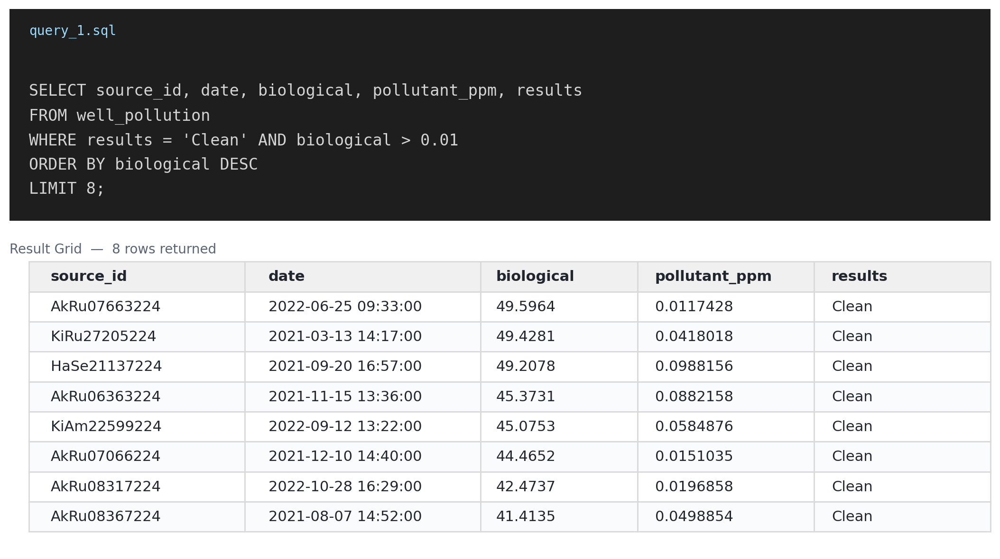

# Maji Ndogo Water Access Investigation

## The Problem

I investigated Maji Ndogo's water-project data to uncover problems with water
access, water quality, and project records — so decision-makers could identify
which communities and projects most urgently needed attention and resources.

## My Approach

I started by exploring the Maji Ndogo dataset to understand what information
was available and how the different tables connected — including water
sources, visits, employees, audit records, and water pollution data.

As I investigated, I checked whether results actually made sense rather than
assuming a query returning results meant the query was correct. This helped
me catch and correct problems in my query logic. Finally, I used the
corrected results to identify patterns and suspicious or inconsistent
records worth further investigation.

## The Key Moment

While validating water source records, I wanted to check whether every well
officially marked "Clean" actually deserved that label, instead of just
trusting the field. I expected that if a well's `results` column said
"Clean," its contamination readings would be low.

Running the numbers showed otherwise. The query below returned wells labeled
"Clean" with biological contamination readings as high as nearly 50 — almost
5,000 times above the 0.01 safety threshold used elsewhere in the dataset:

```sql
SELECT source_id, date, biological, pollutant_ppm, results
FROM well_pollution
WHERE results = 'Clean' AND biological > 0.01
ORDER BY biological DESC
LIMIT 8;
```



This mattered because it wasn't a query error — the SQL ran fine and returned
results either way. The problem was that I almost accepted the "Clean" label
at face value without checking whether the underlying numbers actually
supported it. Catching this taught me that a query returning results isn't
the same as a query returning *correct* results — a value can look fine on
the surface and still be logically inconsistent underneath, in a way that's
easy to miss without deliberately checking the output against what you'd
actually expect.

## What It Revealed

Once I started checking results against expectations instead of trusting
labels at face value, the data surfaced records that didn't fit the expected
pattern — wells marked safe despite contamination levels far above the
threshold used to define "Clean" everywhere else in the dataset. This showed
me that the dataset contained records that needed further investigation
rather than being accepted as accurate.

## Why It Matters

The Maji Ndogo project is ultimately about providing reliable water services
to communities. If a well is marked "Clean" when it is actually
contaminated, decision-makers could believe a water source is safe to use
when it actually still needs remediation. Using data to surface these
inconsistencies helps direct investigation and resources toward the wells
that genuinely need them — which, in this case, could mean the difference
between a community believing their water is safe and it actually being
safe.

## Skills Demonstrated

- **SQL joins** — combining information across multiple tables to investigate a real problem
- **CTEs (Common Table Expressions)** — breaking complex queries into smaller, easier-to-understand steps
- **Subqueries and debugging** — identifying when a query was logically wrong even though it ran without error
- **Data validation** — checking whether query results actually made sense, rather than assuming correct-looking SQL meant correct results
- **Data investigation** — using SQL to identify inconsistent or suspicious records and turn messy data into useful information
